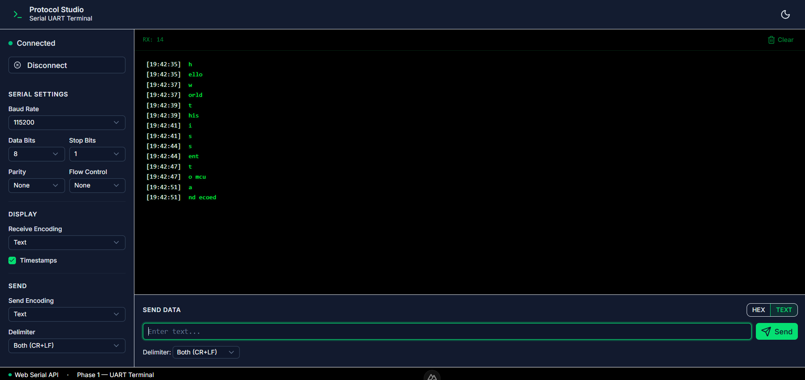

<div align="center">

# Protocol Studio

<p>A modern browser-based **Serial UART Terminal** built with Nuxt UI v4 and the Web Serial API. <br> 
Connect to serial devices, send and receive data in real-time with a retro terminal aesthetic.</p> 

[](https://nuxt.com)
[](https://vuejs.org)
[](https://tailwindcss.com)
[](https://ui.nuxt.com)
[](https://typescriptlang.org)
[](LICENSE)
[](https://pnpm.io)



</div>

---

## Features

| Feature | Description |
|---------|-------------|
| 🔌 **Web Serial API** | Connect to serial devices directly from the browser (Chrome/Edge) |
| 📡 **Real-time Monitoring** | Receive and display serial data instantly |
| ⌨️ **Send Data** | Send text or hex data with configurable delimiters |
| 🎨 **Retro Terminal** | Vintage phosphor-green terminal with dark/light theme support |
| ⚙️ **Configurable** | Baud rate, data bits, stop bits, parity, flow control |
| 🕐 **Timestamps** | Optional timestamps for received data |
| 💾 **Persistent Settings** | Configuration saved to localStorage |

---

## Application Architecture

```
┌─────────────────────────────────────────────────────────┐
│                      Browser Client                     │
│                                                         │
│  ┌──────────┐   ┌──────────┐   ┌──────────┐          │
│  │   App    │──▶│ Layout   │──▶│  Page    │          │
│  │  .vue    │   │  .vue    │   │ index.vue│          │
│  └──────────┘   └──────────┘   └────┬─────┘          │
│                                      │                │
│              ┌───────────────────────┼───────────┐    │
│              │                       │           │    │
│              ▼                       ▼           ▼    │
│      ┌──────────────┐   ┌──────────────┐ ┌────────┐ │
│      │ SerialPort   │   │ SerialSettings│ │Serial  │ │
│      │ Manager.vue  │   │   .vue       │ │Terminal│ │
│      │              │   │              │ │ .vue   │ │
│      │ - Connect    │   │ - Baud Rate  │ │        │ │
│      │ - Disconnect │   │ - Data Bits  │ │- RX     │ │
│      └──────┬───────┘   └──────┬───────┘ │- TX     │ │
│             │                  │          │        │ │
│             └──────────────────┴──────────┴───┬────┘ │
│                                                │     │
│                                        ┌───────▼────┐ │
│                                        │ SerialSend │ │
│                                        │   .vue     │ │
│                                        │            │ │
│                                        │- Input     │ │
│                                        │- Send Btn  │ │
│                                        └──────┬─────┘ │
│                                               │       │
└───────────────────────────────────────────────┼───────┘
                                                  │
                    ┌─────────────────────────────┘
                    │
                    ▼
        ┌─────────────────────────┐
        │      Composables        │
        │                         │
        │  ┌──────────────────┐   │
        │  │   useSerial      │   │
        │  │                  │   │
        │  │ - openPort()     │   │
        │  │ - closePort()    │   │
        │  │ - send()         │   │
        │  │ - isConnected()  │   │
        │  └──────────────────┘   │
        │                         │
        │  ┌──────────────────┐   │
        │  │ useSerialSettings│   │
        │  │                  │   │
        │  │ - settings ref   │   │
        │  │ - localStorage   │   │
        │  └───────��──────────┘   │
        └─────────────────────────┘
                    │
                    ▼
        ┌─────────────────────────┐
        │     Web Serial API      │
        │   (Browser Native)      │
        │                         │
        │ - SerialPort            │
        │ - ReadableStream        │
        │ - WritableStream        │
        └─────────────────────────┘
```

---

## Project Structure

```
protocol-studio/
├── app/
│   ├── components/
│   │   ├── SerialPortManager.vue   # Port connection management
│   │   ├── SerialSettings.vue      # Serial configuration panel
│   │   ├── SerialTerminal.vue      # Retro terminal display
│   │   └── SerialSend.vue          # Send data input
│   ├── composables/
│   │   ├── useSerial.ts            # Web Serial API wrapper
│   │   └── useSerialSettings.ts    # Settings state management
│   ├── pages/
│   │   └── index.vue               # Main application page
│   └── assets/css/
│       └── main.css                # Global styles
├── docs/
│   └── preview_app.png             # Application screenshot
├── nuxt.config.ts                  # Nuxt configuration
├── package.json
└── README.md
```

---

## Tech Stack

| Technology | Purpose |
|------------|---------|
| [Nuxt 4](https://nuxt.com) | Vue framework with SSR & file-based routing |
| [Vue 3](https://vuejs.org) | Progressive JavaScript framework |
| [TypeScript](https://typescriptlang.org) | Type-safe development |
| [Nuxt UI v4](https://ui.nuxt.com) | Headless UI component library |
| [Tailwind CSS v4](https://tailwindcss.com) | Utility-first CSS framework |
| [Web Serial API](https://developer.mozilla.org/en-US/docs/Web/API/Web_Serial_API) | Browser serial port communication |
| [Lucide Icons](https://lucide.dev) | Beautiful open-source icons |

---

## How To Build and Run

### Prerequisites

- [Node.js](https://nodejs.org/) 18+
- [pnpm](https://pnpm.io/) package manager
- [Google Chrome](https://www.google.com/chrome/) or [Microsoft Edge](https://www.microsoft.com/edge) (for Web Serial API support)

### Installation

```bash
# Clone the repository
git clone https://github.com/your-org/protocol-studio.git
cd protocol-studio

# Install dependencies
pnpm install
```

### Development

```bash
# Start development server on http://localhost:3000
pnpm dev
```

### Production Build

```bash
# Build for production
pnpm build

# Preview production build locally
pnpm preview
```

### Code Quality

```bash
# Run linter
pnpm lint

# Run type checker
pnpm typecheck
```

---

## Deployment

### GitHub Pages

1. **Create GitHub repository** and push your code:
   ```bash
   git init
   git add .
   git commit -m "Initial commit"
   git remote add origin https://github.com/your-username/protocol-studio.git
   git push -u origin main
   ```

2. **Enable GitHub Pages** in repository settings:
   - Go to **Settings** → **Pages**
   - Select **Deploy from a branch**
   - Choose **main** branch and **/(root)** folder
   - Click **Save**

3. **Build with SPA mode** for GitHub Pages:
   ```bash
   # Update nuxt.config.ts to output SPA
   # Then build
   pnpm build
   ```

4. **Deploy with gh-pages** (alternative):
   ```bash
   npm install -D gh-pages
   # Add scripts to package.json
   # "predeploy": "pnpm build",
   # "deploy": "gh-pages -d .output/public"
   pnpm deploy
   ```

---

## Browser Compatibility

| Browser | Version | Web Serial API |
|---------|---------|----------------|
| Chrome | 89+ | ✅ Supported |
| Edge | 89+ | ✅ Supported |
| Firefox | ❌ | Not available |
| Safari | ❌ | Not available |

> **Note:** Web Serial API is only available on Chromium-based browsers (Chrome, Edge, Opera).

---

## License

This project is licensed under the MIT License - see the [LICENSE](LICENSE) file for details.

---

<div align="center">

**Built with ❤️ using Nuxt UI**

</div>
